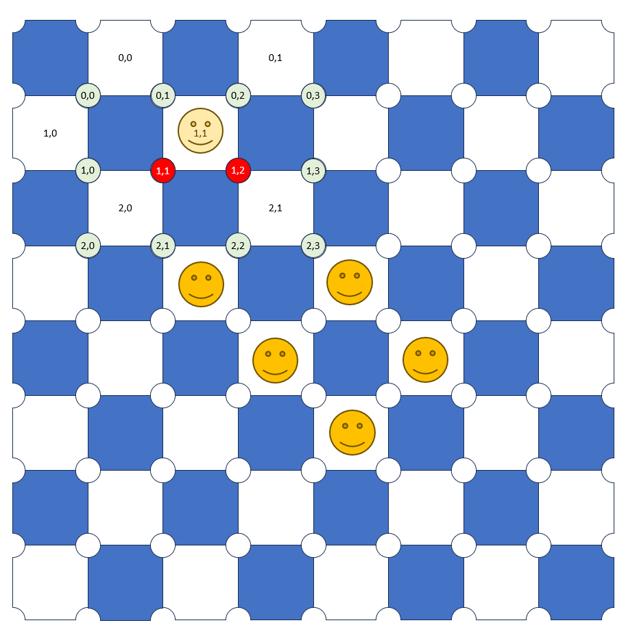

# GuerillaCheckersAI — a Roadmap


Here are the steps you'll need to follow to build and train an AI agent for Guerrilla Checkers:

1. **Implement Game Rules**: You need to create a [programmable interface](#designing-a-programmable-interface) for the game that allows an AI agent to interact with it. This interface should be able to provide the current state of the game to the agent, accept actions from the agent, and update the game state based on these actions. It should also be able to determine and communicate the outcome of the game (win, lose) to the agent.

2. **Design the State and Action Spaces**: The state space should represent all possible configurations of the game board, and the action space should represent all possible moves the agent can make. For Guerilla Checkers, the state space could be a couple of matrix representing the game board and the amount of captured Guerilla stones, and the action space could be a list of all possible moves.  

3. **Choose a Learning Agent Approach**: Reinforcement Learning (RL) is a type of machine learning where an agent learns to make decisions by taking actions in an environment to achieve a goal. The agent learns from the consequences of its actions, adjusting its behavior to maximize the reward in the long run. You can use Q-learning, a model-free reinforcement learning algorithm, to train your agent. Some other approaches you could try are Deep Reinforcement Learning (DRL), AlphaZero and [Genetic Algorithms](#genetic-algorithm-add-on).

4. **Reward Function**: You need to define a reward function for the agent. The agent gets a positive reward for winning the game, a negative reward for losing, and a smaller negative reward for each move to encourage the agent to win in the shortest possible number of moves.

5. **Training the Agent**: You can train the agent by having it play the game multiple times. At each step, the agent chooses an action, observes the new state and reward, and updates its knowledge based on the observed reward. Over time, the agent will learn to make better decisions that maximize its total reward.

6. **Planning**: To make the agent more sophisticated, you can incorporate planning using techniques like Monte Carlo Tree Search (MCTS). MCTS builds a search tree over time and uses sampling to estimate the value of each move. This can help the agent make better decisions, especially in complex situations.

7. **Evaluation**: Finally, you should evaluate your agent's performance by having it play against a human player or another AI agent. This will help you understand how well your agent has learned to play the game.

Developing an AI agent for a game is a complex task that requires a good understanding of both the game and the chosen machine learning techniques. It's a process of trial and error, and you'll likely need to tweak your approach as you go along.

## Suitable Approaches 

Although Reinforcement Learning (RL) can be used for this task, there can be significant gains in using transformative neural networks and generative algorithms in training the agent. Here's why.

In traditional reinforcement learning methods such as Q-learning, the agent maintains a table (Q-table) that stores the expected reward for each action in each state, which requires explicit enumeration of all states and actions. However, this approach becomes infeasible for environments with large state spaces or continuous state spaces, as the size of the Q-table would be prohibitively large. Combining neural networks with reinforcement learning leads to **Deep Reinforcement Learning** (DRL). DRL algorithms, like Deep Q-Networks (DQN) or policy gradient methods (like A3C or PPO), have been very successful in learning complex games, including Go and various video games. These algorithms use neural networks to approximate the Q-function (in Q-learning) or the policy function, enabling them to handle large or continuous state/action spaces. The neural network can generalize from the states and actions it has seen to similar states and actions it hasn't seen, allowing it to handle large or continuous state spaces effectively.

In the case of Guerrilla Checkers, you would train the DRL agent by having it play the game many times and learn from the outcomes of its actions. The agent does not need to know all possible states in advance; it learns to handle new states as it encounters them during training.

The neural network in DRL takes the game state as input and outputs a value for each possible action, representing the expected future reward for taking that action in the current state. The network is trained to update these values based on the rewards the agent actually receives as it interacts with the environment.


**Transformative Neural Networks**, such as Convolutional Neural Networks (CNNs) or Transformer models, can be used to extract and learn features from the game state, which can be beneficial in games where the state representation is high-dimensional or complex (like images or sequences). For example, in a game where the state is represented as a grid or matrix (like a checkerboard), a CNN can learn spatial hierarchies and detect patterns that can be crucial for decision-making.

**Generative models** can be used to generate new game scenarios or states that the agent might not have encountered during training. This can help the agent generalize its learning to a wider range of scenarios, improving its robustness and adaptability. For example, a Generative Adversarial Network (GAN) could be used to generate new game states, which can then be used to augment the training data. There are several reasons why you might want to use a generative model to create new game states:

1. **Robustness**: While the game always starts from the same state, the states encountered during the game can vary widely. Training the agent on a diverse range of game states can help it learn to handle a wide variety of situations, making it more robust.

2. **Efficiency**: Training an agent by playing full games from the start can be time-consuming, especially for complex games where games can last for a large number of moves. Training on individual game states can be more efficient, as it allows the agent to experience a wider variety of situations in less time.

3. **Exploration**: In reinforcement learning, maintaining a balance between exploration (trying new things) and exploitation (doing what works) is crucial. Training on generated game states can encourage exploration by presenting the agent with situations it might not encounter otherwise.

4. **Generalization**: Training on a diverse range of game states can help the agent generalize its learning to new situations. This can be particularly useful in games where the number of possible states is extremely large.

5. **Transfer Learning**: If you're training agents for multiple similar games, you could potentially use a generative model to create game states for one game based on the states of another game. This could allow the agent to transfer its learning from one game to another.

In the context of Guerrilla Checkers, using a generative model to create new game states could potentially help the agent learn to handle a wide variety of situations more efficiently and robustly. 

**AlphaZero**, developed by DeepMind, combines a transformative neural network with Monte Carlo Tree Search (MCTS) and a variant of Q-learning to train game-playing agents. It uses a neural network to guide the search process in MCTS and to estimate the Q-values. This approach has been extremely successful and has achieved superhuman performance in games like Chess, Shogi, and Go.

However, these methods also come with their own challenges, such as increased computational requirements and the need for careful tuning and implementation. They also require a larger number of training episodes compared to simpler methods. Therefore, the choice to use these methods should be guided by the complexity of the game and the resources available.

## Evolutionary Algorithms Add-On

Evolutionary Algorithms (EAs) and Deep Reinforcement Learning (DRL) are two different types of learning algorithms, each with its own strengths. GAs are good at exploring a large solution space and can find good solutions even in complex, multimodal landscapes. DRL, on the other hand, is good at fine-tuning a solution and learning from sequential experiences.

Here's how you might combine the two for training an AI agent for Guerrilla Checkers:

1. **Initialize Population with DRL Agents**: Start by training several DRL agents independently. Each agent will have its own neural network with its own weights and biases. These agents make up the initial population for the EA. Start with a population of simple network architectures. In the context of CNNs, this could mean a network with a single convolutional layer and a single fully connected layer.

2. **Define Fitness Function**: The fitness function should measure how well an agent plays Guerrilla Checkers. One simple approach is to have each agent play several games against a fixed set of opponents and use the agent's win rate as its fitness.

3. **Evaluation**: Evaluate each network in the population by using it to play Guerrilla Checkers and recording its performance. The performance could be measured as the win rate over a set number of games.

4. **Selection**: Select the best-performing networks to reproduce and create the next generation. The selection process could be done through tournament selection, where a subset of the population is chosen at random and the best network in that subset is selected to reproduce.

5. **Crossover**: Create new networks by combining the architectures and weights of two parent networks. This could involve swapping layers between the parents or taking a weighted average of their weights.

6. **Mutation**: Randomly alter the architecture and weights of the new networks. This could involve adding or removing layers, changing the number of neurons in a layer, changing the kernel size in a convolutional layer, or perturbing the weights. This introduces variation into the population and helps prevent the EA from getting stuck in local optima.

7. **Replacement**: Replace some of the worst-performing agents in the population with the newly created agents.

8. **Repeat**: Continue the process of selection, crossover, mutation, and replacement until the population converges to a good solution or a fixed number of generations have passed.

This approach combines the global exploration capabilities of GAs with the local exploitation capabilities of DRL. The GA explores the space of possible neural network weights, while DRL fine-tunes the weights to maximize the agent's performance. However, keep in mind that this is a high-level description of the process. The details can get quite complex, especially when it comes to implementing the crossover and mutation operations for neural network weights. You'll also need to carefully tune the parameters of both the EA and the DRL algorithm to get good results.

### Suitable Evolutionary Algorithms

Given the specific problem of developing a Convolutional Neural Network (CNN) agent for Guerrilla Checkers, and considering that the game states are represented as integers, you might want to consider the following evolutionary algorithms:

1. **Genetic Algorithms (GA)**: GAs are a versatile choice and can be used for optimizing both the architecture and the weights of the CNN. You can represent the architecture of the CNN as a string or a tree, where each node represents a layer, and the edges represent the connections between the layers. The weights of the CNN can be represented as a vector of real numbers. GAs can handle both binary and real-valued representations, making them a flexible choice for this problem.

2. **Evolution Strategies (ES)**: ES, especially Covariance Matrix Adaptation Evolution Strategy (CMA-ES), can be a good choice for optimizing the weights of the CNN. ES are well-suited for continuous optimization problems, and since the weights of a neural network are real-valued, ES can be a good fit. However, they might not be the best choice for optimizing the architecture of the CNN, as they are not as well-suited to discrete optimization problems.

3. **Particle Swarm Optimization (PSO)**: PSO is another option for optimizing the weights of the CNN. Like ES, PSO is well-suited to continuous optimization problems. However, it might not be the best choice for optimizing the architecture of the CNN.

4. **NeuroEvolution of Augmenting Topologies (NEAT)**: NEAT is a specific type of genetic algorithm designed for the optimization of neural network architectures. It evolves not only the weights of the network but also the structure (topology) of the network. This could be a good choice if you want to optimize both the architecture and the weights of the CNN.

In summary, if you want to optimize both the architecture and the weights of the CNN, Genetic Algorithms or NEAT could be a good choice. If you only want to optimize the weights of the CNN, you might want to consider Evolution Strategies or Particle Swarm Optimization. As always, the best choice depends on the specifics of your problem and you might need to experiment with different algorithms to see which one works best.

## Designing a Programmable Interface

Designing a programmable interface (API) for a game like Guerilla Checkers involves creating a set of functions that allow an AI agent to interact with the game. Here's a high-level design of the API:

1. **State Representation**: The game state should be represented as a combination of a 4x4 matrix for the COIN player's checkers and a 7x7 matrix for the Guerrilla player's stones. Different values should be used for empty positions, Guerrilla stones, and COIN checkers. The state should also include the number of remaining Guerrilla stones.

2. **Action Representation**: For the Guerrilla player, an action should be represented as the coordinates of two intersection points where the player wants to place stones. For the COIN player, an action should be represented as the initial and final coordinates of the move or jump.

3. **API Functions**: The API should provide the following functions:

   - `get_current_state()`: This function returns the current state of the game.

   - `get_valid_actions(player)`: This function takes the current player as input and returns a list of valid actions for that player.

   - `take_action(player, action)`: This function takes the current player and an action as input, updates the game state based on the action, checks if the game has ended, and returns the outcome.

   - `is_game_over()`: This function checks if the game is over and returns a boolean value.

   - `get_game_result()`: This function returns the result of the game if it's over.

   - `get_remaining_stones()`: This function returns the number of remaining Guerrilla stones.

Here is some sample code for the API. It's not complete, but it should give you an idea of how the API functions might be implemented.

```python
import numpy as np

# Initialize the game state
coin_state = np.zeros((4, 4))  # 4x4 matrix for COIN checkers
guerrilla_state = np.zeros((7, 7))  # 7x7 matrix for Guerrilla stones

# Function to update the state
def update_state(player, position):
    if player == 'COIN':
        coin_state[position] = 1
    elif player == 'Guerrilla':
        guerrilla_state[position] = 1

# Function to get the current state
def get_current_state():
    return coin_state, guerrilla_state, get_remaining_stones()

def get_remaining_stones():
    # The total number of Guerrilla stones at the start of the game
    total_stones = 66  

    # Count the number of stones that have already been placed on the board
    placed_stones = np.sum(guerrilla_state)

    # Count the number of stones that have been captured by the COIN player
    # This will depend on how you're tracking captures in your game state
    # For example, you might have a separate variable or data structure for this
    captured_stones = count_captured_stones()  # Replace with actual code

    # Subtract the number of placed and captured stones from the total number of stones
    remaining_stones = total_stones - placed_stones - captured_stones

    # Return the number of remaining stones
    return remaining_stones

# Function to get valid actions for a player
def get_valid_actions(player):
    # Initialize an empty list to store the valid actions
    valid_actions = []

    # Check which player's turn it is
    if player == 'COIN':
        # Iterate over the COIN state matrix
        for i in range(4):
            for j in range(4):
                # If the current square contains a COIN checker
                if coin_state[i][j] == 1:
                    # Check all possible moves for this checker
                    # This will depend on the specific movement rules of Guerrilla Checkers
                    # Add each valid move to the valid_actions list
                    # Each action could be represented as a tuple of the initial and final coordinates
                    pass  # Replace with actual code

    elif player == 'Guerrilla':
        # The Guerrilla player can place a stone on any empty intersection point
        # Iterate over the Guerrilla state matrix
        for i in range(7):
            for j in range(7):
                # If the current intersection point is empty
                if guerrilla_state[i][j] == 0:
                    # This is a valid action
                    # Add it to the valid_actions list
                    # The action could be represented as the coordinates of the intersection point
                    pass  # Replace with actual code

    # Return the list of valid actions
    return valid_actions

# Function to take an action
def take_action(player, action):
    # Check which player's turn it is
    if player == 'COIN':
        # The action for the COIN player is a move or jump
        # It can be represented as a tuple of the initial and final coordinates
        initial, final = action

        # Update the COIN state matrix
        # Remove the checker from the initial position
        coin_state[initial] = 0
        # Add the checker to the final position
        coin_state[final] = 1
        
        #defining the function for jump
        def is_jump(initial, final):
            # It returns True if the move was a jump and False otherwise
            # You need to check if there was a stone in between the initial and final positions
            pass  # Replace with actual code

        # If the move was a jump, remove the captured Guerrilla stone
        if is_jump(initial, final):
            # Get the position of the captured stone
            position = get_captured_stone_position(initial, final)  # Replace with actual code
            # update the Guerrilla state matrix to remove the captured stone 
            remove_captured_stone(guerrilla_state, position)  # Replace with actual code
            # Count the number of stones that have been captured by the COIN player
            rise_count_of_captured_stones()  # Replace with actual code

    elif player == 'Guerrilla':
        # The action for the Guerrilla player is the placement of a stone
        # It can be represented as the coordinates of the intersection point
        position = action

        # Update the Guerrilla state matrix
        # Add a stone to the chosen intersection point
        guerrilla_state[position] = 1

    # After taking the action, check if the game is over
    # This will depend on the specific endgame conditions of Guerrilla Checkers
    game_over = is_game_over()

    # If the game is over, get the result
    if game_over:
        result = get_game_result()
        return result

    # If the game is not over, return None
    return None

```

### Game Class

The `Game` class for Guerrilla Checkers should encapsulate the rules and state of the game. Here's a rough idea of what it might look like:

```python
class Game:
    def __init__(self):
        # Initialize the game state
        self.state = self.initial_state()

    def initial_state(self):
        # Return the initial game state
        # This should be a representation of the game board
        # For Guerrilla Checkers, this could be a 4x4 matrix for COIN checkers,
        # a 7x7 matrix for Guerrilla stones, and an integer for remaining Guerrilla stones
        pass

    def get_state(self):
        # Return the current game state
        pass

    def get_current_player(self):
        # Return the current player ('COIN' or 'Guerrilla')
        pass

    def is_over(self):
        # Return True if the game is over, False otherwise
        pass

    def take_action(self, action):
        # Update the game state based on the given action
        # Return the new state, the reward for the action, and whether the game is over
        pass

    def get_valid_actions(self, player):
        # Return a list of valid actions for the given player
        pass
```

The `initial_state` method should return the initial state of the game. For Guerrilla Checkers, this could be a 4x4 matrix for the COIN checkers, a 7x7 matrix for the Guerrilla stones, and an integer for the remaining Guerrilla stones.

The `get_state` method should return the current state of the game.

The `get_current_player` method should return the current player, which could be either 'COIN' or 'Guerrilla'.

The `is_over` method should return `True` if the game is over (i.e., one player has won or there are no valid moves left), and `False` otherwise.

The `take_action` method should update the game state based on the given action. It should return the new state, the reward for the action (which could be 0 for most actions and a positive or negative value for winning or losing the game), and a boolean indicating whether the game is over.

The `get_valid_actions` method should return a list of valid actions for the given player. For Guerrilla Checkers, an action could be represented as a tuple of coordinates representing the start and end points of a move.

This is a high-level design and the actual implementation might vary based on the specific rules and requirements of Guerilla Checkers. For example, you might need to add additional functions to the API to track the number of captured stones or to check if a move is valid.

## An Agent for Guerrilla Checkers

Now that we have an API for the game, we can start building an agent.
If an agent is represented by a neural network, it's often in the context of Deep Reinforcement Learning (DRL). In DRL, the agent's "knowledge" is stored in the weights of a neural network. This neural network, often referred to as a policy network, takes the current state as input and outputs the probabilities of taking each possible action.

Here's a simplified example of what a DRL agent class might look like using PyTorch:

```python
import torch
import torch.nn as nn
import torch.optim as optim

# Define the neural network that will be used to predict action probabilities
class PolicyNetwork(nn.Module):
    def __init__(self, state_size, action_size):
        super(PolicyNetwork, self).__init__()
        # Define the first fully connected layer
        self.fc1 = nn.Linear(state_size, 128)
        # Define the second fully connected layer
        self.fc2 = nn.Linear(128, action_size)
    
    # In PyTorch, the `forward` method is a special function that defines the forward pass of a neural network. It's where you specify how your inputs (in this case, the `state`) get transformed into the outputs (in this case, the `action_probs`).
    def forward(self, state):
        # Pass the state through the first fully connected layer and apply ReLU activation function
        x = torch.relu(self.fc1(state))
        # Pass the result through the second fully connected layer and apply softmax to get action probabilities
        action_probs = torch.softmax(self.fc2(x), dim=-1)
        return action_probs

# Define the agent
class DRLAgent:
    def __init__(self, state_size, action_size, learning_rate):
        # Initialize the policy network
        self.network = PolicyNetwork(state_size, action_size)
        # Initialize the optimizer
        self.optimizer = optim.Adam(self.network.parameters(), lr=learning_rate)
    
    def choose_action(self, state, valid_actions):
       # Convert the state to a PyTorch tensor
       state = torch.tensor(state, dtype=torch.float32)
       # Get the action probabilities from the policy network
       action_probs = self.network(state)
       # Zero out the probabilities for invalid actions
       # `valid_actions` is a Boolean tensor of the same shape as `action_probs` that indicates which actions are valid in the current state (with `True` for valid actions and `False` for invalid actions). The function zeros out the probabilities for invalid actions and then renormalizes the action probabilities so they still sum to 1. It then samples an action according to these modified action probabilities.
       action_probs[~valid_actions] = 0
       # Renormalize the action probabilities
       action_probs /= action_probs.sum()
       # Sample an action according to the action probabilities
       action = torch.multinomial(action_probs, 1).item()
       return action

    def update_knowledge(self, state, action, reward, next_state):
        # Convert the state, reward, and next state to PyTorch tensors
        state = torch.tensor(state, dtype=torch.float32)
        next_state = torch.tensor(next_state, dtype=torch.float32)
        reward = torch.tensor(reward, dtype=torch.float32)

        # Get the probability of the taken action from the policy network
        current_action_prob = self.network(state)[action]
        # Get the maximum action value for the next state
        next_action_prob = self.network(next_state).max().item()

        # Calculate the loss
        loss = -torch.log(current_action_prob) * (reward + next_action_prob)
        # Zero the gradients
        self.optimizer.zero_grad()
        # Backpropagate the loss
        loss.backward()
        # Update the weights of the policy network
        self.optimizer.step()
```

In this example, `PolicyNetwork` is a simple neural network with one hidden layer. It takes the current state as input and outputs the probabilities of taking each possible action. `DRLAgent` is the agent class. It has a `PolicyNetwork` and an optimizer. The `choose_action(state)` method uses the policy network to choose an action based on the current state. The `update_knowledge(state, action, reward, next_state)` method updates the weights of the policy network based on the observed reward and the maximum action value of the next state.

You would need to implement a separate function to generate the `valid_actions` tensor based on the current state and the rules of the game. This function would be called before `choose_action` in each step of the game.

Please note that this is a simplified example and doesn't include all the necessary functionality for a complete DRL agent, such as handling the exploration-exploitation trade-off or using a replay buffer for experience replay. You'll need to add these features based on your specific requirements.

## Input Representation

In the case of Guerrilla Checkers, where the game state is represented by a 4x4 matrix (for COIN player's checkers), a 7x7 matrix (for Guerrilla player's stones), and an integer (for remaining Guerrilla stones), you could structure the input to the CNN in a few different ways. Here are a couple of possibilities:

1. **Stack the Matrices**: You could stack the 4x4 and 7x7 matrices together to form a 3D tensor (similar to a multi-channel image). The 4x4 matrix could be zero-padded to match the size of the 7x7 matrix. The integer representing the remaining Guerrilla stones could be incorporated as a separate channel filled with the same value, or it could be input separately into a fully connected layer later in the network.

2. **Separate Paths for Each Input**: You could have separate convolutional paths for the 4x4 and 7x7 matrices, which would allow the network to learn features at different scales. The outputs of these paths could then be concatenated and fed into a fully connected layer. The integer representing the remaining Guerrilla stones could be input into this fully connected layer as well.

In either case, the convolutional layers of the CNN would be able to learn spatial features from the 4x4 and 7x7 matrices, such as the configuration of stones in different parts of the board.

Here's a rough sketch of what the first option might look like in code:

```python
class PolicyNetwork(nn.Module):
    def __init__(self):
        super(PolicyNetwork, self).__init__()
        # Convolutional layers
        self.conv1 = nn.Conv2d(3, 32, kernel_size=3, stride=1, padding=1)
        self.conv2 = nn.Conv2d(32, 64, kernel_size=3, stride=1, padding=1)
        # Fully connected layer
        self.fc = nn.Linear(64*7*7, num_actions)

    def forward(self, state):
        # Apply convolutional layers with ReLU activation
        x = F.relu(self.conv1(state))
        x = F.relu(self.conv2(x))
        # Flatten the output for the fully connected layer
        x = x.view(x.size(0), -1)
        # Get action probabilities
        action_probs = F.softmax(self.fc(x), dim=-1)
        return action_probs
```

In this code, `state` would be a 3D tensor with shape `[3, 7, 7]`, where the first dimension represents the channels (one for the COIN player's checkers, one for the Guerrilla player's stones, and one for the remaining Guerrilla stones). The `forward` method applies two convolutional layers with ReLU activation, flattens the output, and then applies a fully connected layer with softmax activation to get the action probabilities.

Remember that this is just a starting point. You would likely need to adjust the architecture and hyperparameters of the network to get good performance on the Guerrilla Checkers game.

## Training

Once you have a working agent and a Game class, you can train it by playing games against itself. In the game of Guerrilla Checkers, there are two distinct agents - COIN and Guerrilla. They have different rules and strategies, so it's important to differentiate between them in the code. You can use the following pseudocode as a starting point:

```python
# Initialize the agents
coin_agent = DRLAgent()
guerrilla_agent = DRLAgent()

# Number of games to play for training
num_games = 10000

# Loop over the games
for i in range(num_games):
    # Reset the game state
    game = Game()

    # Play the game until it's over
    while not game.is_over():
        # Get the current state
        state = game.get_state()

        # Determine the current player
        current_player = game.get_current_player()

        # Let the appropriate agent choose an action
        if current_player == 'COIN':
            action = coin_agent.choose_action(state)
        else:
            action = guerrilla_agent.choose_action(state)

        # Perform the action and get the new state
        new_state, reward, done = game.take_action(action)

        # Let the appropriate agent observe the result
        if current_player == 'COIN':
            coin_agent.observe((state, action, reward, new_state, done))
        else:
            guerrilla_agent.observe((state, action, reward, new_state, done))

        # If the game is over, let the agents know
        if done:
            coin_agent.end_episode()
            guerrilla_agent.end_episode()

    # Train the agents using the observations from this game
    coin_agent.train()
    guerrilla_agent.train()

    # Occasionally save the agents' weights
    if i % 1000 == 0:
        coin_agent.save_weights(f'coin_weights_{i}.h5')
        guerrilla_agent.save_weights(f'guerrilla_weights_{i}.h5')
```

In this version of the pseudocode, we have two separate `DRLAgent` instances, one for the COIN player and one for the Guerrilla player. The `get_current_player` method of the `Game` class is used to determine which player's turn it is, and the corresponding agent is used to choose an action and observe the result. Both agents are trained and their weights are saved separately.

## Evolution Operations

Here's a simplified example of how crossover and mutation operations might be implemented for a CNN using PyTorch. Please note that this is a very basic example and real-world implementation would be more complex.

```python
import torch
import torch.nn as nn
import copy
import random

# Assume we have a simple CNN model
class SimpleCNN(nn.Module):
    def __init__(self, num_conv_layers):
        super(SimpleCNN, self).__init__()
        self.layers = nn.ModuleList()
        for _ in range(num_conv_layers):
            self.layers.append(nn.Conv2d(3, 64, kernel_size=3, stride=1, padding=1))
        self.layers.append(nn.Flatten())
        self.layers.append(nn.Linear(64, 10))

    def forward(self, x):
        for layer in self.layers:
            x = layer(x)
        return x

# Crossover operation
def crossover(parent1, parent2):
    child = copy.deepcopy(parent1)
    for child_layer, parent2_layer in zip(child.layers, parent2.layers):
        # For each layer, randomly choose weights from parent1 or parent2
        for child_param, parent2_param in zip(child_layer.parameters(), parent2_layer.parameters()):
            mask = torch.rand_like(child_param) > 0.5
            child_param.data[mask] = parent2_param.data[mask]
    return child

# Mutation operation
def mutate(network, mutation_rate=0.01):
    for layer in network.layers:
        for param in layer.parameters():
            # For each weight, with a probability of mutation_rate, apply a small random change
            mask = torch.rand_like(param) < mutation_rate
            param.data[mask] += torch.randn_like(param)[mask] * 0.1

# Create two parent networks
parent1 = SimpleCNN(num_conv_layers=2)
parent2 = SimpleCNN(num_conv_layers=2)

# Perform crossover
child = crossover(parent1, parent2)

# Perform mutation
mutate(child)
```

In this example, the `crossover` function creates a child network that inherits weights from two parent networks. For each weight, it randomly chooses whether to inherit from parent1 or parent2.

The `mutate` function applies small random changes to the weights of a network. For each weight, with a probability of `mutation_rate`, it adds a random value drawn from a normal distribution.

Please note that this is a simplified example and doesn't take into account many factors that would be important in a real-world implementation, such as maintaining the same number of layers in the child network as in the parent networks, or ensuring that the mutated weights still allow the network to function properly.

In a real-world scenario, parent networks could have different numbers of layers or different structures. Handling this situation would require a more complex crossover function.

One approach could be to align layers based on their type and position in the network (e.g., the first Conv2d layer in parent1 corresponds to the first Conv2d layer in parent2), and perform crossover only for these aligned layers. If one parent has more layers of a certain type than the other, the extra layers could be either randomly included or excluded in the child, or always included or always excluded, depending on the specific crossover strategy you choose.

Another approach could be to define a set of rules for how to handle different layer types during crossover. For example, you could decide that a Conv2d layer can be replaced with another Conv2d layer with different parameters, or that a MaxPool2d layer can be replaced with an AvgPool2d layer, and so on.

The key point is that the specific details of the crossover function (and the mutation function) will depend on the specific problem you're trying to solve, the types of network architectures you're considering, and the specific evolutionary strategy you're using.